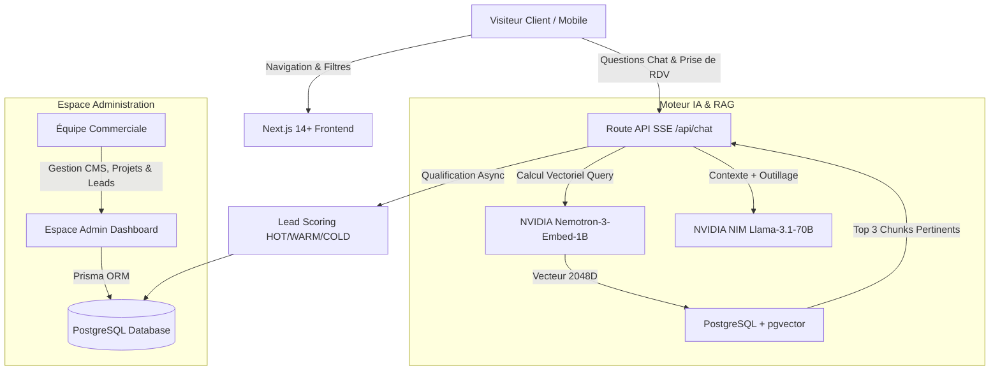

# 📐 Dossier Technique & Architecture Système — Résidence Aurea

Ce document récapitule l'architecture technique, la pile technologique (Stack), le fonctionnement du moteur d'IA RAG et les composants de la plateforme web immobilière **Résidence Aurea**.

---

## 🏛️ 1. Vue d'Ensemble de l'Architecture

La plateforme **Résidence Aurea** est une application web moderne "phygitale" combinant la présentation de biens immobiliers de luxe et un conseiller commercial IA disponible 24/7.



---

## 💻 2. Stack Technologique (Technologies Utilisées)

### A. Frontend (Interface Utilisateur)
* **Framework :** Next.js 14+ (App Router, Server Components & Client Components).
* **Bibliothèque UI :** React 18 (Architecture réactive moderne).
* **Utilisation des Hooks React :**
  * `useState` & `useReducer` : Gestion de l'état réactif local et global (filtres du catalogue, états des formulaires, flux de messages du chat, fenêtres modales d'administration).
  * `useEffect` : Synchronisation des effets de bord (chargement de l'historique de session local `localStorage`, pré-qualification des appartements, auto-scroll des messages).
  * `useRef` : Référencement du DOM (défilement automatique du fil de discussion de l'agent IA, conteneur de carte Leaflet).
  * `useSearchParams` & `usePathname` : Synchronisation en temps réel des filtres de recherche et des intentions de réservation avec l'URL.
  * `useContext` : Diffusion globale de la langue (`LanguageProvider`) et de la direction d'affichage (LTR/RTL).
* **Langage :** TypeScript (Typpage strict de bout en bout).
* **Styles & Design System :** Tailwind CSS + effets de Glassmorphic UI. Charte graphique haut de gamme (Slate sombre `#0f172a` et accents Dorés `#d97706`).
* **Icônes :** Lucide React.
* **Cartographie :** Leaflet / OpenStreetMap (Intégration dynamique des coordonnées des projets).
* **Internationalization (i18n) :** Prise en charge multilingue (Français, Anglais, Arabe avec basculement automatique du layout en RTL `dir="rtl"`).

### B. Backend & API Infrastructure
* **Runtime :** Node.js runtime unifié avec Next.js App Router.
* **Streaming d'IA :** Server-Sent Events (SSE) via `ReadableStream` pour l'affichage fluide et progressif des réponses du conseiller virtuel.
* **Authentification Securisée :** NextAuth (Provider Credentials pour l'Espace Administrateur).
* **CMS Visual Customizer :** Éditeur dynamique avec panneau de prévisualisation en temps réel via `iframe` et événements `postMessage`.

### C. Moteur d'Intelligence Artificielle & RAG
* **Modèle d'Embedding (Vectorisation) :** `nvidia/nemotron-3-embed-1b` via l'infrastructure NVIDIA NIM.
  * *Caractéristiques :* Modèle de 1 Milliard de paramètres produisant des vecteurs de **2048 dimensions**.
* **Modèle de Langage & Raisonnement (LLM) :** `meta/llama-3.1-70b-instruct` via l'API OpenAI-compatible NVIDIA NIM.
* **Moteur RAG (Retrieval-Augmented Generation) :**
  * Recherche par **similarité cosinus** directement en SQL natif via l'extension PostgreSQL `pgvector` (`1 - (embedding <=> query::vector)`).
  * Optimisation de latence avec détection des salutations (réponse instantanée $< 150\text{ ms}$).
* **Suite d'Outils Agent (Function Calling) :**
  1. `search_apartments` : Recherche multicritère d'appartements (prix, surface, pièces).
  2. `get_apartment_details` : Consultation des fiches techniques.
  3. `get_documents` : Téléchargement des brochures et plans 3D.
  4. `get_available_slots` : Consultation des créneaux de visite libres.
  5. `create_appointment` : Réservation de visite privée.
  6. `escalate_to_human` : Transfert d'alerte à un conseiller humain.

### D. Base de Données & Persistance
* **SGBD :** PostgreSQL (Version 15+).
* **Extension Vectorielle :** `pgvector` (prise en charge des index vectoriels 2048 dimensions).
* **ORM :** Prisma 7 (`@prisma/client` avec adaptateur de pool natif `@prisma/adapter-pg`).
* **Devise Principale :** Dinar Tunisien (**TND / DT**).

### E. Notifications & E-Mails
* **Générateur iCalendar (`.ics`) :** Formatage UTC automatique pour l'envoi de fichiers d'invitation de rendez-vous dans les agendas clients (Google Calendar, Outlook, Apple Calendar).
* **Fournisseur E-mail :** Provider générique (Resend / SMTP).

---

## 🗄️ 3. Schéma des Données (Modèles Principaux)

1. **`Project` :** Programme immobilier (Nom, localisation GPS, photos, statut).
2. **`Apartment` :** Appartements et attiques (Référence, prix en TND, surface m², pièces, orientation, étage, statut).
3. **`Document` & `DocumentChunk` :** Brochures PDF, plans 3D et leurs vecteurs d'indexation 2048D.
4. **`Lead` :** Prospects qualifiés (Nom, email, téléphone, score `HOT`/`WARM`/`COLD`, budget min/max, urgence).
5. **`Conversation` & `Message` :** Historique des échanges entre le client et l'agent IA.
6. **`Appointment` :** Rendez-vous de visites planifiés (Créneau ISO, type de visite, statut d'approbation).
7. **`CmsSection` & `SiteSettings` :** Réglages graphiques, polices, couleurs et contenus dynamiques de la landing page.

---

## 🛠️ 4. Procédure d'Installation & Déploiement

### Prérequis
* Node.js 18+ et npm
* Docker & Docker Compose
* Clé API NVIDIA NIM (`NVIDIA_NIM_API_KEY`)

### Étape 1 : Lancement de la Base de Données (Docker)
```bash
docker compose up -d
```

### Étape 2 : Synchronisation du Schéma & Seed Initial
```bash
npx prisma db push
npx tsx prisma/seed.ts
```

### Étape 3 : Réindexation Vectorielle RAG (Nemotron-3)
```bash
npx tsx scripts/reindex-all.ts
```

### Étape 4 : Lancement du Serveur de Développement
```bash
npm run dev
```
Accès à l'application sur `http://localhost:3001`.

---

## 🔒 5. Déploiement en Production (Docker Container)

Un fichier **`Dockerfile`** multi-étapes optimisé est disponible à la racine du projet :
1. **Étape `deps` :** Installation des dépendances.
2. **Étape `builder` :** Génération du client Prisma et build Next.js (`output: "standalone"`).
3. **Étape `runner` :** Image Alpine ultra-légère exécutant le serveur de production `server.js`.

---
*Dossier technique préparé pour l'équipe d'ingénierie & la direction de la Résidence Aurea.*
