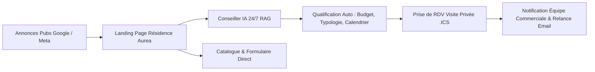

# Plan d'Activation E-Marketing & Recommandations de Lancement — Résidence Aurea

Ce document définit la stratégie d'acquisition, le tunnel de conversion phygital, les indicateurs de performance (KPIs) et le calendrier de lancement pour le programme immobilier haut de gamme **Résidence Aurea** (14 Avenue Montaigne, 75008 Paris).

---

## 🏛️ 1. Positionnement Stratégique & Typologie des Audiences

### Positionnement
La **Résidence Aurea** incarne l'alliance parfaite entre l'architecture contemporaine d'exception et la haute technologie au service de l'habitant. Avec 24 suites et attiques de prestige, le programme s'adresse à une clientèle exigeante en recherche d'exclusivité, de confort et de valorisation patrimoniale.

### Audiences Cibles
1. **Acquéreurs Résidence Principale (CSP++) :** Cadres dirigeants, professions libérales, entrepreneurs à la recherche d'un cadre de vie d'exception avec terrasse et conciergerie.
2. **Investisseurs Patrimoniaux & Family Offices :** Investisseurs à fort pouvoir d'achat recherchant des actifs rares avec rendement locatif pérenne et fiscalité maîtrisée.
3. **Clientèle Internationale & Non-Résidents :** Acquéreurs étrangers recherchant un pied-à-terre parisien sécurisé avec accompagnement digital et visite virtuelle.

---

## 🚀 2. Plan Médias Multi-Canal (Stratégie d'Acquisition)

| Canal | Format & Emplacement | Ciblage Stratégique | Objectif principal |
| :--- | :--- | :--- | :--- |
| **Meta Ads** (Instagram / FB) | Reels 4K, Carrousels 3D, Stories interactives | Intérêts : Architecture de luxe, Immobilier de prestige, Haute horlogerie, CSP+ (Paris & métropoles) | Notoriété, Génération d'intérêt visuel et clics vers la Landing Page |
| **Google Search** | Annonces textuelles ciblées & Performance Max | Mots-clés intentionnistes : *"Penthouse luxe Paris 8"*, *"Appartement neuf Avenue Montaigne"*, *"Achat appartement attique prestige"* | Capture du besoin qualifié à forte intention d'achat |
| **LinkedIn Ads** | Single Image & Message Ads direct aux décideurs | Titres : CEO, Managing Director, Partner, Notaires, Avocats d'affaires | Qualification B2B / Investisseurs très haut de gamme |
| **Retargeting Display** | Bannières dynamiques & Vidéo | Prospects ayant visité la landing page sans planifier de visite | Relance personnalisée avec accroche conseiller IA |

---

## 🔄 3. Tunnel de Conversion & Parcours Client (Phygital)

### Points Clés du Parcours :
1. **Accroche Immersive :** Arrivée sur la Landing Page fluide avec visuels 3D HD de la Résidence Aurea et bouton CTA immédiat.
2. **Engagement IA Sans Friction :** Le conseiller virtuel IA répond en temps réel (Français, Anglais, Arabe) aux questions sur les plans, prix, prestations et disponibilités.
3. **Capture Consentie RGPD :** Recueil naturel du budget, de l'usage prévu (résidence vs investissement) et des coordonnées lors de l'envoi de brochures ou de la réservation.
4. **Prise de Rendez-vous Automatisée :** Proposition de créneaux de visite synchronisés avec envoi d'invitations iCalendar (.ics) par email.

---

## 📊 4. Indicateurs Clés de Performance (KPIs & Métriques)

### A. Performance d'Acquisition (Média)
* **Taux de clic (CTR) Média :** $\ge 2.8\%$ sur Meta Ads / $\ge 5.5\%$ sur Google Search.
* **Coût par Clic (CPC moyen) :** $0.90€ - 1.60€$.
* **Taux de Rebond Landing Page :** $< 32\%$.

### B. Engagement Agent IA & Conversion
* **Taux d'engagement Chat IA :** $\ge 22\%$ des visiteurs lancent une discussion avec l'agent IA.
* **Taux de conversion Chat $\rightarrow$ Prospect Qualifié :** $\ge 18\%$.
* **Durée moyenne des échanges IA :** $> 3.5$ minutes (preuve d'intérêt fort).

### C. Performance Commerciale & Conversion Finale
* **Taux de prospects qualifiés "HOT" :** $\ge 25\%$ (Budget $> 400k€$, projet $< 3$ mois).
* **Taux de conversion Visiteur $\rightarrow$ Prise de RDV :** $\ge 7.5\%$.
* **Coût par Prospect Qualifié (CPL) :** $< 42€$.

---

## 🗓️ 5. Calendrier de Lancement en 4 Phases

### Phase 1 : Teasing & Audit Technique (Semaines 1 - 2)
- Validation complète du socle Next.js, pgvector et du modèle IA NVIDIA NIM.
- Configuration du domaine `residence-aurea.fr`, des balises SEO et du consentement RGPD.
- Création des visuels de marque et de la plaquette commerciale PDF.

### Phase 2 : Grand Lancement & Campagne d'Acquisition (Semaines 3 - 6)
- Activation des campagnes Google Search, Meta Ads et LinkedIn Ads.
- Déploiement du conseiller virtuel IA en mode actif sur la landing page.
- Suivi quotidien des conversions et A/B testing des titres et visuels.

### Phase 3 : Nurturing & Relances Commerciales (Semaines 7 - 10)
- Automatisation des emails de relance pour les prospects tièdes ("WARM").
- Transfert systématique des prospects "HOT" à l'équipe commerciale sous 15 minutes.
- Organisation des premières visites privées sur le chantier / showroom.

### Phase 4 : Optimisation & Clôture des Ventes (Semaines 11+)
- Bilan des conversions et ajustement des budgets médias sur les canaux les plus rentables.
- Finalisation des réservations et accompagnement notarié.

---

## 💡 6. Recommandations Opérationnelles pour le Succès

1. **Réactivité Hybride IA / Humain :** Lorsqu'un prospect demande un interlocuteur humain ou pose une question hautement spécifique, l'outil `escalate_to_human` alerte immédiatement l'équipe commerciale dans le tableau de bord Admin.
2. **A/B Testing Continu :** Tester deux variantes d'accroches sur le Hero de la landing page (Exemple A : *"L'Élégance Absolue au Cœur de Paris"* vs Exemple B : *"Attiques & Suites Penthouses d'Exception"*).
3. **Transparence & RGPD :** Conserver la mention de consentement sous le widget de chat pour renforcer la confiance des acquéreurs exigeants.

---
*Document produit pour la Direction Commerciale de la Résidence Aurea.*
